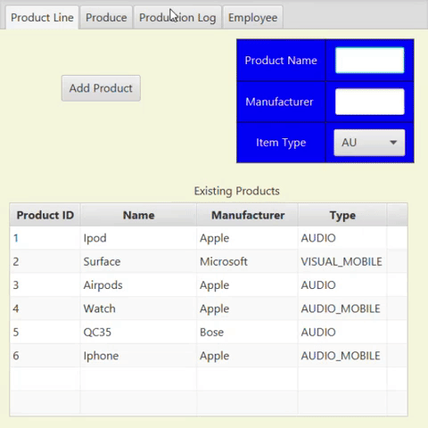

# ProductionProject
This is a semester long project for the fall of 2020, and it is a production line tracker. I am working independently on this project throughout the course of this semester. 
The project began in August 2020, when I was pretty inexperienced with databases and object oriented programming. As my skill grows the project will be enhanced through
multiple sprints. 
 
The project has just finished it's third sprint in December of 2020, and I am much more proficient in Object Oriented Programming. I enjoyed the project because it was a project that allowed freedom throughout the implementation process. Which allowed me to refine my critical thinking skills, and work on good programming habits.

## Demonstration

## Documentation
[JavaDoc](https://obrien2231.github.io/ProductionProject)
## Diagrams
Class diagram for the project  
   
Database Diagram  
 

## Getting Started
Download the zip file, then unzip the folder. Open the unzipped folder in an IDE of your choice but the following instructions will be for Intellij.
After opening the unzipped file in Intellij, Run -> Edit Configurations -> VM configurations -> paste the text below replacing the PathToYourJavaFXSDK with the path to your JavaFX SDK
## Built with
Built in Intellij  
Scenebuilder was also used when developing the Graphical User Interface  

## Contributing

## Author
Padraig O'Brien

## License
[License](License.txt)

## Acknowledgments
Throughout the process StackOverflow, w3 schools, jenkov, and oracle were all websites used  
Classmate Adam Paul was very helpful with assistance in debugging and testing  
Professor Vanselow and Teaching assistant Jeremy Martin were invaluable with their assistance  

## History

## Key Programming Concepts Utilized
Classes - The ability to design and implement classes using object oriented methods. 
Inheritance - Demonstrates the understanding of the hierarchy systems of class structure. Which allows subclasses to inherit properties from the superclass. 
Polymorphism - Allows us to treat inherited methods in different ways, allowing programmers to be flexible in the implementation of the inherited properties. 
Encapsulation - Using data-hiding and abstration encapsulation allowing us to access data from a class, without exposing the code or implementation inside of the class. 
